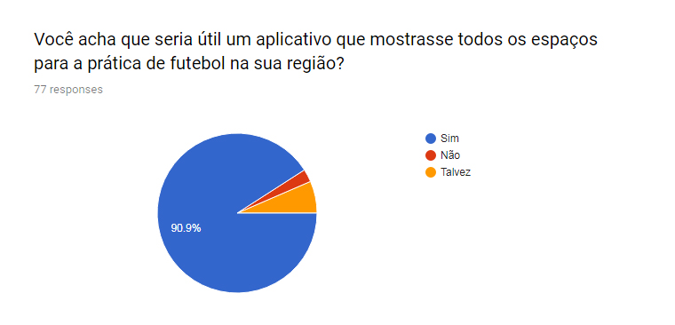
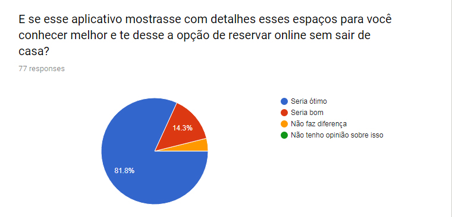

# Projeto Open House
## App de Busca de Quadras Esportivas #PartiuJogar

### Descrição da Aplicação
* Criar um produto de entretenimento utilizando APIs externas.
* UX: Aprofundamento dos conhecimentos de UX
* Internet: Aprender como é o funcionamento da internet, o que são e pra que servem (alguns) protocolos, como funciona a comunicação cliente-servidor e como fazer requisições.
* API REST: Descobrir como utilizar APIs, com exemplos práticos utilizando a API de Geolocalização Here. 
* Agilidade: Recapitulação dos conceitos de agilidade, como criar um projeto-base, o que são e para que servem alguns rituais/ferramentas de scrum e kanban.

## Índice

* [Linguagem de programação](#Linguagem-de-programação)
* [Autoria](#Autoria)
* [Definição do Produto](#Definição-do-produto)
* [Histórias de Usuários](#Histórias-de-Usuários)
* [Concorrência](#Concorrência)
* [Entrevistas com Usuários](#Entrevistas-com-Usuários)
* [Personas](#Personas)
* [Protótipo](#Protótipo)
* [Teste de Usabilidade](#Teste-de-usabilidade)
* [Business Model Canvas](#Business-Model-Canvas)

### Linguagem de Programação
Essa página foi desenvolvida em JavaScript (ES6+), HTML e CSS.
Foi utilizado o Framework Bootstrap v4, foi consumido a API Here e foi utilizado o banco de dados Firebase.

## Autoria
O projeto foi desenvolvido por: **Amanda Gomes**, **Fabiane Albuquerque**, **Laiz Araújo**, **Maria Eduarda**, **Tatiane Tabata** e **Vanessa Yoshida**.

### Roadmap do projeto
## Definição do Produto
Para a definição do App #PartiuJogar foram respondidas as seguintes perguntas:

1. App onde os usuários possam encontrar locais para pratica de esportes. O usuário poderá encontrar através de uma API de localização lugares próximos ou que tenha um esporte específico, conhecer melhor o lugar através de fotos 360° e agendar online.
* Localização
* Estado em que a quadra se encontra
* Preços
* Agenda com datas disponíveis
* Estacionamento
* Vestiários
* Lanchonete/Espaço para churrasco

Para as quadras cadastradas será prestado serviço de divulgação com fotos da local em 360°, espaço para avaliação, controle de agendamento e pagamento. 

2. Para a versão 2 os usuários poderão sugerir suas quadras para o app oferecer seus serviços.

3. Para essa versão fazer métodos de criação de times.

### Histórias de usuário
[Pesquisa](https://drive.google.com/file/d/1_itpfioPYtlCzApJET9rtqVor4NtMgkr/view?usp=sharing)

### Concorrência
Na busca por “quadras para alugar” retorna os sites das próprias quadras. Nesse caso o usuário necessita entrar em site por site para conhecer o local.
Para sites de busca foi encontrado o Guia Mais e Sampa Online porem eles não tem opção de agendamento online.

### Entrevistas com Usuários
Na entrevista realizada com usuários foi mostrado que gostariam de um app para buscar quadras, ver o local com foto 360, saber as comodidades que tem no estabelecimento e poder agendar online.
[Pesquisa](https://docs.google.com/forms/d/e/1FAIpQLSdNR0QVOVZQO2rQiDewZl7AqkBtdxUucZGncY8ZsVqKxOrDWQ/viewform)

### Personas
[Link das Personas](https://docs.google.com/document/d/19DyEV91pZXRt7bac0e5ksczo1137NNXxZwSPdtOLdY8/edit)

## Protótipo
[Link do Protótipo](https://xd.adobe.com/view/a492e102-86c5-49ab-7b8f-bacf65139054-d2a3/?fullscreen)

### Testes de Usabilidade
Foi feito um protótipo de baixa fidelidade para a primeira versão do projeto e os testes de usuário deram como satisfatórios para pesquisar a quadra e agendar online.

[Link do Teste de Usabilidade](https://xd.adobe.com/view/a492e102-86c5-49ab-7b8f-bacf65139054-d2a3/?fullscreen)

### Business Model Canvas
[Business Model Canvas](https://canvanizer.com/canvas/wk5XSOxgCVI6F)
